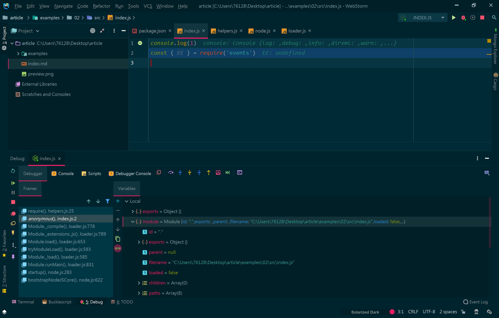
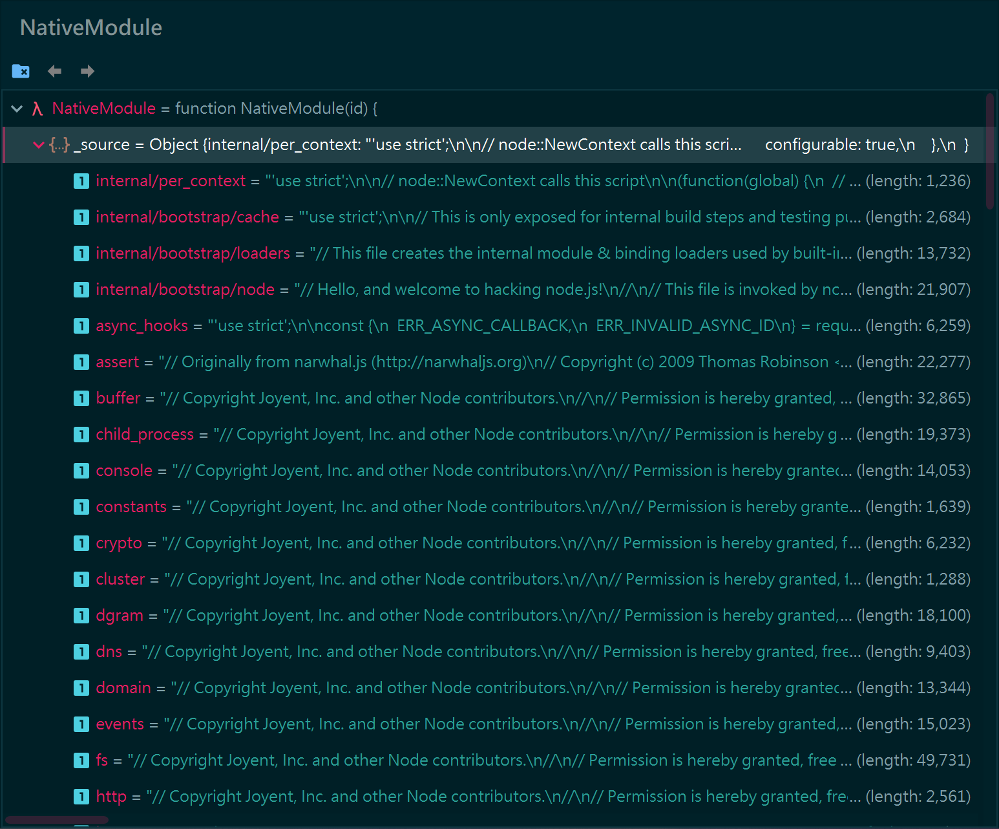
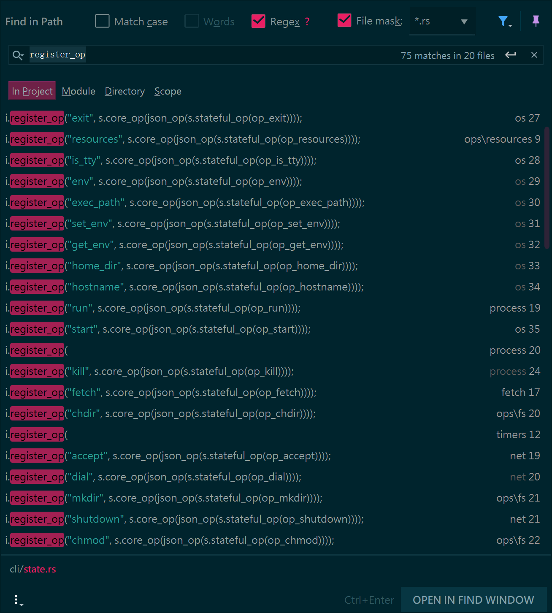

# 浅谈Node.js 下的 Module loader

## 前言

题目的 idea 来自 [这个问题](https://www.zhihu.com/question/349550048/answer/864295558)

## Node.js 下的 Module Loader

在 Node.js 中，每个文件都视作一个单独的模块，所以我们可以这么写

```js
// index.js
const module1 = require('./module1')

console.log(module1.foo(0))

console.log(module1.goo(0)(0))
```

```js
// module1/index.js
exports.foo = a => a + 114514
exports.goo = b => a => foo
```

在 Node.js 源代码中，我们可以找到 `require` 函数的实现，其中 `id` 是 一个非空 string

```js
// Loads a module at the given file path. Returns that module's
// `exports` property.
Module.prototype.require = function(id) {
  validateString(id, 'id');
  if (id === '') {
    throw new ERR_INVALID_ARG_VALUE('id', id,
                                    'must be a non-empty string');
  }
  requireDepth++;
  try {
    return Module._load(id, this, /* isMain */ false);
  } finally {
    requireDepth--;
  }
};
```

我们可以看到，最顶层会有一个 `requreDepth` 来控制调用深度，具体什么用，我们可以接下来看到

然后 `require` 直接调用 `Module._load`

顺带一提，`Module` 是一个类（JS意义上的类）

```js
function Module(id = '', parent) {
  this.id = id;
  this.path = path.dirname(id);
  this.exports = {};
  this.parent = parent;
  updateChildren(parent, this, false);
  this.filename = null;
  this.loaded = false;
  this.children = [];
}
```

继续看 `_load`

```js
// Check the cache for the requested file.
// 1. If a module already exists in the cache: return its exports object.
// 2. If the module is native: call
//    `NativeModule.prototype.compileForPublicLoader()` and return the exports.
// 3. Otherwise, create a new module for the file and save it to the cache.
//    Then have it load  the file contents before returning its exports
//    object.
Module._load = function(request, parent, isMain) {
    // 一大堆代码，暂时不贴上来
}
```

我们可以从注释中看到，他会先查看缓存中是否有模块，或者是否为 Native 模块，最后才会加载文件

三个参数，第一个是地址，第二个是父地址，第三个是判断是否主文件的boolean

其中，加载 Native 会一直调用到 `src/node_binding.cc`

```cpp
void GetInternalBinding(const FunctionCallbackInfo<Value>& args) {
  Environment* env = Environment::GetCurrent(args);

  CHECK(args[0]->IsString());

  // 模块名称
  Local<String> module = args[0].As<String>();

  // 转到 UTF-8 String
  node::Utf8Value module_v(env->isolate(), module);
  Local<Object> exports;

  node_module* mod = get_internal_module(*module_v);
  if (mod != nullptr) {
    // 能找到内部的 module
    exports = InitModule(env, mod, module);
  } else if (!strcmp(*module_v, "constants")) {
    exports = Object::New(env->isolate());
    CHECK(
        exports->SetPrototype(env->context(), Null(env->isolate())).FromJust());
    DefineConstants(env->isolate(), exports);
  } else if (!strcmp(*module_v, "natives")) {
    exports = native_module::NativeModuleEnv::GetSourceObject(env->context());
    // Legacy feature: process.binding('natives').config contains stringified
    // config.gypi
    CHECK(exports
              ->Set(env->context(),
                    env->config_string(),
                    native_module::NativeModuleEnv::GetConfigString(
                        env->isolate()))
              .FromJust());
  } else {
    return ThrowIfNoSuchModule(env, *module_v);
  }

  args.GetReturnValue().Set(exports);
}
```

我们打一个断点看看



```json
{
  "id": ".",
  "exports": {},
  "parent": null,
  "filename": "C:\\Users\\76128\\Desktop\\article\\examples\\02\\src\\index.js",
  "loaded": false,
  "children": [],
  "paths": [
    "C:\\Users\\76128\\Desktop\\article\\examples\\02\\src\\node_modules",
    "C:\\Users\\76128\\Desktop\\article\\examples\\02\\node_modules",
    "C:\\Users\\76128\\Desktop\\article\\examples\\node_modules",
    "C:\\Users\\76128\\Desktop\\article\\node_modules",
    "C:\\Users\\76128\\Desktop\\node_modules",
    "C:\\Users\\76128\\node_modules",
    "C:\\Users\\node_modules",
    "C:\\node_modules"
  ]
}
```

其中的 Module 实例，`paths` 保存了所有能找到的 `node_modules` 黑洞

然后我们断点看到 `NativeModule._source` 里面已经保存了所有的内建代码，所以直接返回 `NativeModule.require(filename)` （如图）

```js
  const mod = loadNativeModule(filename, request, experimentalModules);
  if (mod && mod.canBeRequiredByUsers) return mod.exports;
```



---

我们写一个互相调用的 example

```js
let M
M = require('./module')

console.log(M)
```

```js
// module/index.js
module.exports = {
  ...require('./1'),
  ...require('./2')
}
```

```js
// module/1.js
require('./2')

module.exports = {
  foo: 1
}
```

```js
// module/2.js
require('./1')

module.exports = {
  goo: 2
}
```

第一次加载，没有缓存，他会调用到 `Module.prototype.load`

```js
// Given a file name, pass it to the proper extension handler.
Module.prototype.load = function(filename) {
  debug('load %j for module %j', filename, this.id);

  assert(!this.loaded);
  this.filename = filename;
  this.paths = Module._nodeModulePaths(path.dirname(filename));

  const extension = findLongestRegisteredExtension(filename);
  // allow .mjs to be overridden
  if (filename.endsWith('.mjs') && !Module._extensions['.mjs']) {
    throw new ERR_REQUIRE_ESM(filename);
  }
  Module._extensions[extension](this, filename);
  this.loaded = true;

  if (experimentalModules) {
    const ESMLoader = asyncESM.ESMLoader;
    const url = `${pathToFileURL(filename)}`;
    const module = ESMLoader.moduleMap.get(url);
    // Create module entry at load time to snapshot exports correctly
    const exports = this.exports;
    // Called from cjs translator
    if (module !== undefined && module.module !== undefined) {
      if (module.module.getStatus() >= kInstantiated)
        module.module.setExport('default', exports);
    } else {
      // Preemptively cache
      // We use a function to defer promise creation for async hooks.
      ESMLoader.moduleMap.set(
        url,
        // Module job creation will start promises.
        // We make it a function to lazily trigger those promises
        // for async hooks compatibility.
        () => new ModuleJob(ESMLoader, url, () =>
          new ModuleWrap(url, undefined, ['default'], function() {
            this.setExport('default', exports);
          })
        , false /* isMain */, false /* inspectBrk */)
      );
    }
  }
};
```

默认情况下允许读取 `.js`, `.mjs`, `.node`, `.json`

然后 `.js` 文件调用 `.js` 相关的handle

```js
Module._extensions['.js'] = function(module, filename) {
  // ...省略多余判断
  const content = fs.readFileSync(filename, 'utf8');
  module._compile(content, filename);
};
```

而 `_compiler` 则做了一通检查，然后调用 [`vm.runInThisContext`](https://nodejs.org/dist/latest-v12.x/docs/api/vm.html)，本文不阐述非 module 部分

我们来看 `.mjs` 是如何处理的，首先，moduleJS与commonJS最大的区别就是

mjs是**静态加载模块**

如何理解呢？

```js
// index.mjs
console.log('this is main script')

import { foo } from './module/index.mjs'

console.log(foo)
```

```js
// module/index.mjs
export let foo = 1

console.log('this is module')
```

然后我们运行 `node.js` 的实验功能

```bash
> node --experimental-modules ./src/index.mjs
(node:9932) ExperimentalWarning: The ESM module loader is experimental.
this is module
this is main script
1
```

如果我们用相同的代码，用commonJS编写

```js
console.log('this is main script')

const { foo } = require('./module')

console.log(foo)
```

```js
exports.foo = 1

console.log('this is module')
```

```bash
> node ./src/index.js
this is main script
this is module
1
```

mjs的处理方式与cjs方式不同，在 `lib/internal/modules/esm` 文件夹中未另一套方案

目前，`node.js` 目测是模拟了一套esm的静态加载流程

启动脚本为：

```js
'use strict';

const {
  prepareMainThreadExecution
} = require('internal/bootstrap/pre_execution');

prepareMainThreadExecution(true);

const CJSModule = require('internal/modules/cjs/loader').Module;

markBootstrapComplete();

// Note: this loads the module through the ESM loader if
// --experimental-loader is provided or --experimental-modules is on
// and the module is determined to be an ES module
CJSModule.runMain(process.argv[1]);
```

```js
async import(specifier, parent) {
    const job = await this.getModuleJob(specifier, parent);
    const { module } = await job.run();
    return module.getNamespace();
}
```

其中，也有缓存机制

```js
// Tracks the state of the loader-level module cache
class ModuleMap extends SafeMap {
  get(url) {
    validateString(url, 'url');
    return super.get(url);
  }
  set(url, job) {
    validateString(url, 'url');
    if (job instanceof ModuleJob !== true &&
        typeof job !== 'function') {
      throw new ERR_INVALID_ARG_TYPE('job', 'ModuleJob', job);
    }
    debug(`Storing ${url} in ModuleMap`);
    return super.set(url, job);
  }
  has(url) {
    validateString(url, 'url');
    return super.has(url);
  }
}
```

其中 `SafeMap`，就是一个普通的 `Map`，node.js为了防止global变量被修改，所有东西都经过二次封装

```js
// lib/internal/per_context/primordials.js
primordials.SafeMap = makeSafe(
  Map,
  class SafeMap extends Map {}
);
```

---

## Deno 下的 Module Loader

`Deno` 中有一个非常重要的地方，就是权限（Permisson）

我们控制台输入 `deno --help`，可以看到权限选项

```bash
    -A, --allow-all
            Allow all permissions

        --allow-env
            Allow environment access

        --allow-hrtime
            Allow high resolution time measurement

        --allow-net=<allow-net>
            Allow network access

        --allow-read=<allow-read>
            Allow file system read access

        --allow-run
            Allow running subprocesses

        --allow-write=<allow-write>
            Allow file system write access
```

那么，权限是如何实现的呢？我们找了半天，一路向下看到这个地方

```ts
// cli/js/util.ts
export function createResolvable<T>(): Resolvable<T> {
  let methods: ResolvableMethods<T>;
  const promise = new Promise<T>(
    (resolve, reject): void => {
      methods = { resolve, reject };
    }
  );
  // TypeScript doesn't know that the Promise callback occurs synchronously
  // therefore use of not null assertion (`!`)
  return Object.assign(promise, methods!) as Resolvable<T>;
}

// cli/js/dispatch_json.ts
export async function sendAsync(
  opId: number,
  args: object = {},
  zeroCopy?: Uint8Array
): Promise<Ok> {
  const promiseId = nextPromiseId();
  args = Object.assign(args, { promiseId });
  const promise = util.createResolvable<Ok>();

  const argsUi8 = encode(args);
  const buf = core.dispatch(opId, argsUi8, zeroCopy);
  if (buf) {
    // Sync result.
    const res = decode(buf);
    promise.resolve(res);
  } else {
    // Async result.
    promiseTable.set(promiseId, promise);
  }

  const res = await promise;
  return unwrapResponse(res);
}
```

`core.dispatch` 提供了一个native函数调用方法，ry曾说过设计 `node.js` 最大失误就是把各种方法直接绑定到 `v8` 中。

```ts
const buf = core.dispatch(opId, argsUi8, zeroCopy);
```

但是，在 `deno` 中，各种 `native` 方法都绑定到了 `deno.isolate` 中

```rust
// core/core/isolate.rs
/// Defines the how Deno.core.dispatch() acts.
/// Called whenever Deno.core.dispatch() is called in JavaScript. zero_copy_buf
/// corresponds to the second argument of Deno.core.dispatch().
///
/// Requires runtime to explicitly ask for op ids before using any of the ops.
pub fn register_op<F>(&mut self, name: &str, op: F) -> OpId
where
  F: Fn(&[u8], Option<PinnedBuf>) -> CoreOp + Send + Sync + 'static,
{
  self.op_registry.register(name, op)
}
```

```rust
// core/core/ops.rs
/// This function returns None only if op with given id doesn't exist in registry.
pub fn call(
  &self,
  op_id: OpId,
  control: &[u8],
  zero_copy_buf: Option<PinnedBuf>,
) -> Option<CoreOp> {
  // Op with id 0 has special meaning - it's a special op that is always
  // provided to retrieve op id map. The map consists of name to `OpId`
  // mappings.
  if op_id == 0 {
    return Some(Op::Sync(self.json_map()));
  }

  let d = match self.dispatchers.get(op_id as usize) {
    Some(handler) => &*handler,
    None => return None,
  };

  Some(d(control, zero_copy_buf))
}
```



回到正题，我们来看 Module Loader 部分

试着写一个错误代码然后看一下栈信息

```ts
// examples/05/deno.ts
// import了一个不存在的东西
import * as Foo from 'https://himself65.com/foo.ts'
```

```bash
> deno examples/05/deno.ts
Compile file:///C:/Users/76128/Desktop/article/examples/05/deno.ts
Download https://himself65.com/foo.ts
error: Uncaught HttpOther: https://himself65.com/foo.ts: error trying to connect: 不知道这样的主机。 (os error 11001)
► $deno$/dispatch_json.ts:40:11
    at DenoError ($deno$/errors.ts:20:5)
    at unwrapResponse ($deno$/dispatch_json.ts:40:11)
    at sendAsync ($deno$/dispatch_json.ts:91:10)
```

我们可以看见，import 一个外网URL 其实也是通过了 `dispatch`

并通过 `fetch` 函数来进行下载远程 module

```ts
/** Fetch a resource from the network. */
export async function fetch(
  input: domTypes.Request | string,
  init?: domTypes.RequestInit
): Promise<Response> {
  // ...
}
```

然后正常的遵循 `cjs` 规范，也用到了缓存，在控制台通过 `-r` 进行重新下载缓存

```bash
                  -r, --reload=<CACHE_BLACKLIST>
                        Reload source code cache (recompile TypeScript)
                      --reload
                        Reload everything
                      --reload=https://deno.land/std
                        Reload all standard modules
                      --reload=https://deno.land/std/fs/utils.ts,https://deno.land/std/fmt/colors.ts
                        Reloads specific modules
```

其他的调用顺序：`Module` --> `ModuleSpecifier`，懒得写了，自己去读，一个``

`ModuleSpecifier` 实际是一个带了 `Url` 的 new type pattern

```rs
pub struct ModuleSpecifier(Url);
```
